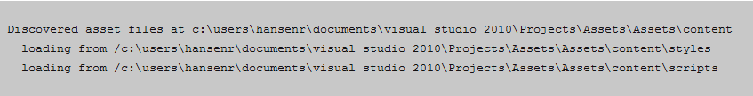

.. _usingassets:

========================
Using the Asset Pipeline
========================

This guide covers how to load :term:`Assets` such as CSS, JavaScript, or image files
on you page.

Asset Pipeline
--------------

FubuMVC includes something called the :term:`Asset Pipeline`.  The asset pipeline is
like dependency injection for CSS and JavaScript assets.  You can define
aliases for your assets and then inject them on the page load.  It allows you to
define dependencies and perform :term:`Combinations` and :term:`Transformations`.

Why would I want to use this?
-----------------------------

JavaScript libraries can get large, so we tend to break them up into multiple
files.  Trying to load those files on the page in order so that you don't have
undefined functions can be challenging.  There are tools like Require.JS that
can help but FubuMVC comes with that built right in.

The Asset Pipeline also allows you to work in friendlier languages than
JavaScript and CSS.  Transformations allow you to convert an asset into a
different format.  You can use any combination of Less, Sass, or CoffeeScript
and have each transformed into CSS or JavaScript respectively.

How does it work?
-----------------

By default FubuMVC will look for CSS files under ``content/styles`` and JavaScript
under ``content/scripts``.  On the first view of a page the pipeline will resolve
all the assets defined for that page.  Then apply any transformations or
combinations to those assets and cache the result on the server.  The pipeline
monitors your asset directories and will automatically update the cache when the
files change.  This allows you to modify your Sass files and simply refresh the
page.

How do I configure it at runtime?
---------------------------------

The Asset Pipeline will look for some configuration files in order to read in
your asset customizations.  Files using the ``*.asset.config`` or
``*.script.config`` format will be automatically found on startup.

Alias long asset names or groups of assets::

  jquery is jquery-1.7.2.min.js
  jquery-ui is jquery-ui-1.8.0.min.js
  jquery-validate is jquery.validate.min.js

Handle ordering of assets::

  jquery-ui requires jquery
  jquery-validate requires jquery

Or::

  ordered set jquery-set is
  jquery
  jquery-ui
  jquery-validate

Or::

  jquery preceeds jquery-ui
  jquery preceeds jquery-validate

Combine assets into a single file for optimal requests::

  combine jquery,jquery-ui,jquery-validate as jquery-combination

How do I configure it in code?
------------------------------

.. code-block:: csharp
  :linenos:

  public class ConfigureFubuMVC : FubuRegistry
  {
    public ConfigureFubuMVC()
    {
      this.Assets().Alias("jquery").Is("jquery-1.7.2.min.js");
      this.Assets().Alias("jquery-ui").Is("jquery-ui-1.8.0.min.js");
      this.Assets().Alias("jquery-validate").Is("jquery.validate.min.js");

      this.Assets().Asset("jquery-ui").Requires("jquery");
      this.Assets().Asset("jquery-validate").Requires("jquery");

      this.Assets().OrderedSet("jquery-set").Is("jquery,jquery-ui,jquery-validate");

      this.Assets().Asset("jquery").Preceeds("jquery-ui");
      this.Assets().Asset("jquery").Preceeds("jquery-validate");

      this.Assets().Combination("jquery-combination").Includes("jquery,jquery-ui,jquery-validate");
    }
  }

What are transformations?
-------------------------

You can transform CoffeeScript to JavaScript by including the CoffeeExtension
registry. The same goes for Sass and Less.

.. code-block:: csharp
  :linenos:

  public class ConfigureFubuMVC : FubuRegistry
  {
    public ConfigureFubuMVC()
    {
      Import<LessExtension>();
      Import<SassExtension>();
      Import<CoffeeExtension>();

      Assets.CombineAllUniqueAssetRequests();
    }
  }

How do I write assets to a page?
--------------------------------

There are a few extension methods that will write out assets to your page.  You
can require an asset to be included on a page by calling
``this.Asset('myAssetName')``.  However to actually write assets to a page you
must tell the page to write the asset with ``this.WriteCssTags()`` or
``this.WriteScripts()`` 

.. code-block:: html

  <use namespace="MyProject" />
  <viewdata model="MyProject.IndexViewModel" />

  #this.Asset("default.css");
  #this.Asset("jquery");

  <html>
    <head>
      <title>Hi</title>
    </head>
    <body>
      <h1>Hi</h1>
      ${ this.WriteCssTags() }
      ${ this.WriteScriptTags() }
    </body>
  </html>

How do I troubleshoot missing assets?
-------------------------------------

When trying to figure out why an asset is not loading, you can call to throw an
exception if an asset that is registered does not exist.  If you want to have
custom behavior for missing assets you can register your own handler.

.. code-block:: csharp
  :linenos:

  public class ConfigureFubuMVC : FubuRegistry
  {
    public ConfigureFubuMVC()
    {
      // This line turns on the basic diagnostics and request tracing
      IncludeDiagnostics(true);

      Assets.YSOD_on_missing_assets(true);
      Assets.HandleMissingAssetsWith<MyMissingAssetHandler>();
    }
  }

You can also use the extensive diagnostics that FubuMVC provides.  By browsing
to ``http://mysite/_fubu/fulllog`` you can view if the asset pipeline found a
problem with your asset file registration.

