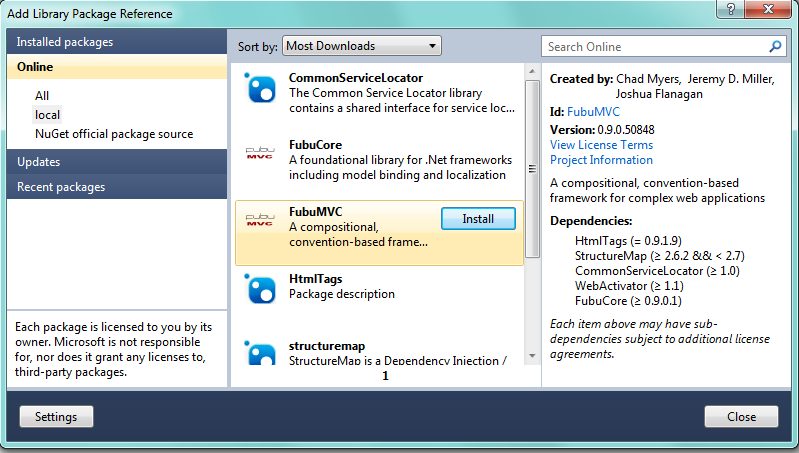
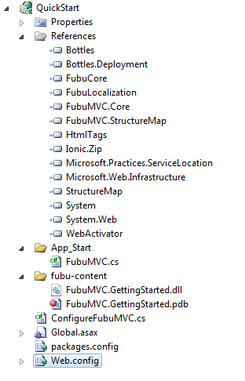
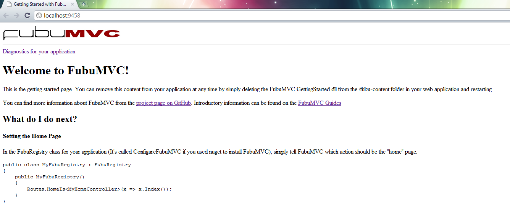
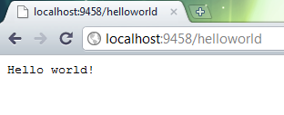
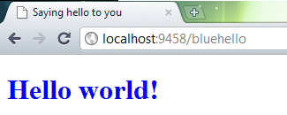
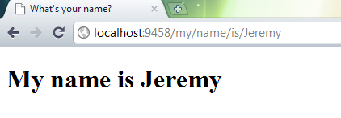
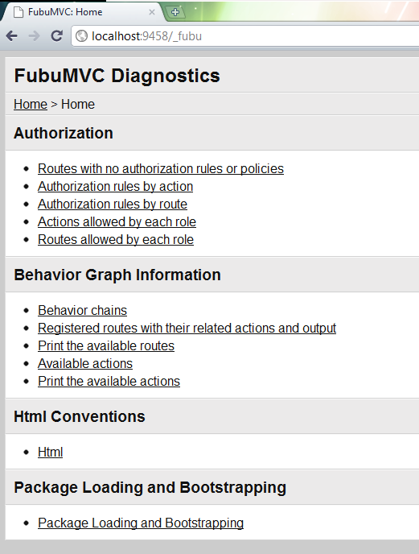
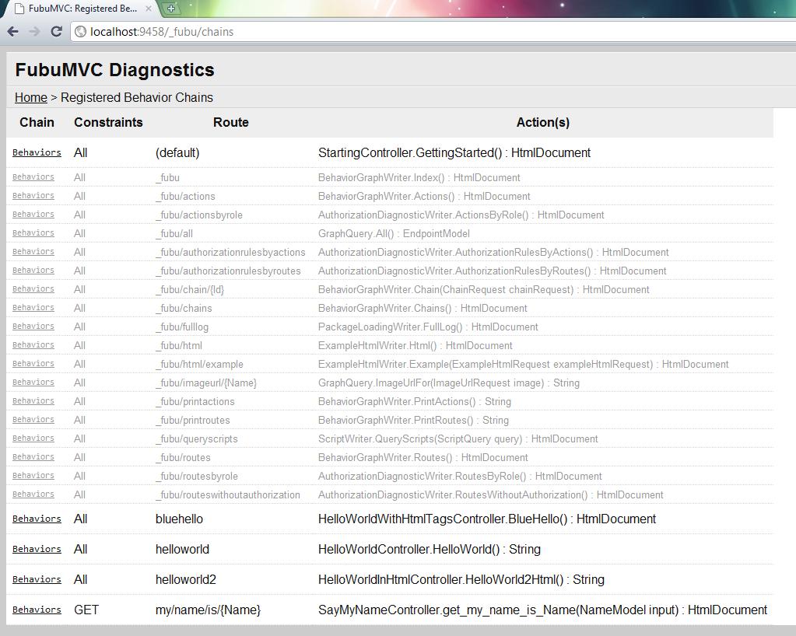

.. _getting-started:

===============
Getting Started
===============

This guide covers getting up and running a simple FubuMVC application.
After reading it, you should be familiar with:

* What FubuMVC is, why I might (or might not) use it, and how I get
  started
* Using Nuget to download and install FubuMVC in a new Visual
  Studio.Net project
* The general layout of a FubuMVC project
* The basic architectural principles of FubuMVC
* Adding simple http endpoints in FubuMVC

.. note::

    All the code used in this guide is available under the QuickStart project
    in the `fubumvc repository on GitHub
    <http://github.com/DarthFubuMVC/fubumvc>`_

This Guide Assumes...
=====================

*  That when you approach a new web application project, your first
   thought isn't to open the designer and start dragging-and-dropping
   your way to the finish line.
*  That you have a copy of Visual Studio 2010 (any SKU). While it is
   possible to run FubuMVC on Mono/Linux with nginx, Apache, or XSP,
   this guide assumes that you are working with Visual Studio.Net.
*  Nuget is installed on your machine
*  You are familiar with building basic ASP.NET applications (either
   WebForms or MVC) and know how to basically get an ASP.NET app working
   in IIS7 (Windows 2008, Windows 7).
*  That you have a good working knowledge of C# 3.0 and .NET 3.5 in
   general including generics, lambda expressions, and using interfaces.
*  That you have a desire to build .NET/ASP.NET-based web applications
   and are looking for a web framework that doesn't get in your way as
   much, allows you to test as much as possible, and helps you stay
   focused on your code and not pleasing your web framework.

.. note::

    fubumvc can work with iis6 (windows 2003) and iis6.1 (xp), but it's more
    complicated to set up. This guide will focus on IIS7.

Introduction to FubuMVC
=======================

What is FubuMVC?
----------------

FubuMVC is a `Front Controller-style
<http://martinfowler.com/eaaCatalog/frontController.html>`_ MVC framework for
.Net written in the C# language. FubuMVC was started by a team of developers
who wanted to stay on the .Net platform but were unhappy with the shape and
direction of ASP.Net MVC. The goals and architectural philosophy of FubuMVC is:

* Exploit the idea of `convention over configuration
  <http://msdn.microsoft.com/en-us/magazine/dd419655.aspx>`_ for better
  productivity, but allow users to teach FubuMVC about their own conventions
  against a well-defined semantic model.

* Decouple your application code from framework code and keep your application
  relatively free from the scourges of Xml configuration, inheritance tangles,
  and attribute soup.

* Remove friction from automated testing of your application code

* Maximize the ability to use composition throughout your application by
  focusing on SOLID principles, separation of concerns, `DRY
  <http://en.wikipedia.org/wiki/Don't_repeat_yourself>`_. Internally, FubuMVC
  uses your application's Inversion of Control container to build out its own
  dependencies.

* Modular architectures. FubuMVC includes the most sophisticated and capable
  infrastructure for modularizing and extending web applications in the .Net
  ecosystem.

* Provide a less painful development experience with informative diagnostics
  about your application

* Use static typing in an advantageous way. Many other alternative web
  frameworks in the .Net space are faithful copies of Ruby or Python frameworks
  that have neither the strengths of Ruby/Python or C#. FubuMVC uses the rich
  metadata from static typing to drive conventions and reduce errors. If you
  prefer Ruby on Rails or Sinatra style development, we think you should use
  Ruby on Rails or Sinatra instead of attempting to work that way inside of C#.

* Eliminate the dreaded "tag soup" problem in views by using advanced html
  helpers and conventions to DRY up your views

What do I need to know before I get started?
--------------------------------------------

FubuMVC is open source. That means it's developed, for free, by dedicated
individuals without a lot of free time (we have families and day jobs). While
we try to provide a nice, polished experience for developer, it can't always
succeed in that objective. FubuMVC is licensed under the permissive Apache 2.0
license: `https://github.com/DarthFubuMVC/fubumvc/raw/master/license.txt
<https://github.com/DarthFubuMVC/fubumvc/raw/master/license.txt>`_.
Contributions are most certainly welcome, just fork the `git repository
<https://github.com/DarthFubuMVC/fubumvc>`_ and start firing off pull requests.

As of May 2011, FubuMVC is powering production websites at 56 companies with
more in development. While we know that FubuMVC will never attain the usage of
the official Microsoft offerings, we would like to have more users just to make
the ecosystem richer and more viable for the long run.

.. note::

    FubuMVC will be rougher and more raw than something you might get from
    Microsoft or a 3rd party library vendor. Please bear with us as we improve
    and make FubuMVC better. Your feedback and suggestions are always welcome.
    Your assistance and time are welcome more, though :)

Core Architecture
=================

FubuMVC takes a slightly different approach to the classic `Model 2 Model View
Controller pattern <http://en.wikipedia.org/wiki/Model_2>`_ that puts more
focus on composing a pipeline of what we call "behaviors" that are completely
unaware of each other rather than the traditional Model-View-Controller triad.

A typical web request for a view will look something like:

#. An http request is received by the web server. The ASP.Net routing module
   acts as a front controller to choose a "chain" of behaviors to execute

#. The first behavior calls an "action" (think Controller) that interacts with
   the rest of your application and returns a view model representing the data
   to be rendered by the view

#. A second behavior invokes a WebForms or Spark view to render the view model
   that was returned from the action in the previous step

As far as a developer is concerned, all the familiar elements of classic MVC
are present, but there's nothing to stop you from composing a different
pipeline of behaviors for more sophisticated request handling.

View Models
-----------

View models are typically `Data Transfer Objects
<http://en.wikipedia.org/wiki/Data_transfer_object>`_ that are either inputs to
or outputs from behaviors. It's probably advantageous to think of view models
as messages passed to or between behaviors. As a baked in "opinion," FubuMVC
strongly prefers that the input models are unique across actions in your
application. FubuMVC can use an input model to resolve Url's or authorization
rules in the system. Likewise, output model signatures from action methods are
used to "attach" view and other output behaviors to a behavior chain.

Actions (Controllers)
---------------------

In classic MVC the controllers have the responsibility of processing the http
input and deciding what data was to be displayed by the view layer.  In FubuMVC
this responsibility is performed by what we simply call "actions." Actions in
FubuMVC are just methods on concrete `POCO
<http://en.wikipedia.org/wiki/Plain_Old_CLR_Object>`_ classes in your
application that will be called during an Http request like the following:

.. literalinclude:: ../../../src/FubuMVC.GuideApp/Controllers/Home/Home.cs
   :language: csharp
   :lines: 5-20
   :linenos:

Typically, you will let FubuMVC marshal the raw Http data into an input model,
then FubuMVC will call your action method directly and store any output where
later behaviors can find it. This is what we call the "one model in, one model
out" philosophy, meaning that actions should typically only be concerned with
your application's data and services rather than exercising framework
machinery.

One of the original goals of FubuMVC was to simplify our controller actions so
that all they had to do was process a request object and return a response with
no coupling to giant base classes or repetitive boilerplate code just to feed
the framework. We believe that the "one model in, one model out" opinion
makes our code easier to read, write, and test by removing the noise code so
prevalent in other .Net solutions. It also greatly improves our ability to
compose the runtime pipeline and creates traceability between parts of the
application.

Views
-----

Now that you've got view models and actions to process them, you need something
to render the view model into html. As of this writing, FubuMVC supports the
Web Forms and Spark view engines. In addition, you can happily have actions
spit out raw html or `HtmlTag/HtmlDocument
<https://github.com/DarthFubuMVC/htmltags>`_ objects.

Behaviors and Behavior Chains
-----------------------------

During day to day development most developers are going to be working strictly
with view models, actions, and views. Internally, the FubuMVC framework sees
all these things as a chain of "behavior" objects nested within each other in
what we frequently refer to as the `Russian Doll Model
<http://codebetter.com/jeremymiller/2011/01/09/fubumvcs-internal-runtime-the-russian-doll-model-and-how-it-compares-to-asp-net-mvc-and-openrasta/>`_.

Even a simple Http request is likely to be handled by multiple behaviors. While
FubuMVC comes out of the box with behaviors for common tasks like Json
serialization/deserialization, calling actions, and rendering views, you can
build your own custom behaviors.

Wrappers
--------

Wrappers are simply behaviors that you can use to perform additional work
during an Http request like authorization checks, caching, activity tracking,
or just extra auditing.

BehaviorGraph and FubuRegistry
------------------------------

FubuMVC contains a configuration model called BehaviorGraph that completely
models how each possible Http endpoint will be handled. For each Http endpoint
in the system, BehaviorGraph models:

#. Routes and Url's
#. Behavior Chains
#. Actions to be called
#. Views or other output behaviors like Json output that will be called
#. Authorization rules
#. Wrappers

You won't work directly with these objects daily, but understanding the
underlying BehaviorGraph model is crucial to writing your own FubuMVC
conventions and policies later.

Inversion of Control Container
------------------------------

FubuMVC is built around the idea of composition, but that composition can come
at a cost. FubuMVC uses your application’s IoC container to assemble all the
various pieces, services, behaviors, and extensions that make up a functioning
FubuMVC application. We like to say that FubuMVC is "Dependency Injection
turtles all the way down," meaning that **all** FubuMVC services are resolved
from the IoC container without hacks like "IDependencyResolver."

At this writing (May 2011), FubuMVC only supports the StructureMap container,
but work is ongoing to add Castle Windsor support for a following release.

Bottles
-------

FubuMVC uses the `Bottles project <https://github.com/DarthFubuMVC/bottles>`_
for modularity.  Bottles can be used to break your application up into
different "areas" or to extend your application with new content or abilities.

Web.config dependencies
-----------------------

I wish it wasn't so, but for now FubuMVC has some required dependencies that
must be configured via Xml in web.config:

#. The System.Web.Routing.UrlRoutingModule module must be registered

#. Access to the folder "Content" should be authorized for all users
   (this is where FubuMVC assumes that content like images, scripts, and
   styles are stored)

#. Access to the folder "\_content" should be authorized for all users
   (this is where FubuMVC assumes that content like images, scripts, and
   styles are stored for packages. This will be changed in the near
   term)

#. Access to the folder "fubu-content" should be denied for all users.
   This folder is related to the Bottles support in FubuMVC

Hello, FubuMVC!
===============

Let's do the inevitable "Hello, World!" exercise in FubuMVC.

Setup a new FubuMVC application
-------------------------------

In Solution Explorer, your project layout should look like this:

Adding the Nuget reference adds a few pieces to your application:

#. Some directives to the web.config file

#. A basic FubuRegistry class called "ConfigureFubuMVC" that registers
   some basic conventions for your application

#. Using the WebActivator library, adds a call in the application start
   event to the FubuApplication class to bootstrap the FubuMVC model,
   Route's, and your IoC container

#. The FubuMVC.GettingStarted package in /fubu-content (you'll remove
   this later)

Fire up your browser!
---------------------

Now, just for fun, let's fire up the application and see what happens.  Make
sure your new QuickStart project is the startup project for your solution and
press F5 to start debugging. Your browser should open to this page:

Don't worry about where that content came from, we'll get to that later " and
how to get rid of it too. Before we get into the details of just what it is
that Nuget dumped into your application, let's do the obligatory "Hello,
world!" exercise.

Say "Hello!"
------------

Alright, assuming that we've got a working application, let's add our first
endpoint to the system. Add a class to your project like this to your project:

.. literalinclude:: ../../../src/QuickStart/SayHelloController.cs
   :language: csharp
   :lines: 1-11
   :linenos:

Compile and restart the web application to bring up the home page again, but
this time, go to the url for ~/helloworld. You should see this:

Pretty cool, right? You managed to spit out a string to the browser window.
Let's try it again, but this time, let's make "Hello world!" render as html:

One last time, but this time let’s add a title to the page and turn the
text blue. This is the point where I don’t care to use raw strings, so
we’re going to switch to using the HtmlTags library. Add this class to
your project and compile:

.. literalinclude:: ../../../src/QuickStart/SayHelloController.cs
   :language: csharp
   :lines: 12-21
   :linenos:

Compile and open your browser to ~/bluehello:

Say my name!
------------

Just to be slightly more challenging, let's create an endpoint that can display
your name with the Url pattern ``~/my/name/is/{Name}.`` Using FubuMVC's
nomenclature for url patterns, ``{Name}`` would be a ``RouteInput`` that you
would have to be supplied as part of the Url.

To implement this endpoint, enter this code and compile:

.. literalinclude:: ../../../src/QuickStart/SayHelloController.cs
   :language: csharp
   :lines: 47-66
   :linenos:

Since **my** name is Jeremy, I'm going to enter the Url "~/my/name/is/Jeremy"
into the browser to get to this page:

How did that stuff get there?
-----------------------------

Open your browser to the main diagnostics page at ~/\_fubu (or click the link
"Diagnostics for your application" from the home page for the application):

Get used to the diagnostics pages (~/\_fubu) because you're going to spend a
lot of quality time with them as you're learning FubuMVC. From here, click
onto the link for "Behavior chains" and look carefully at the bottom four rows
in the table and see what we've got.:

At no point in the "Hello, world" exercise did we explicitly:

#. Register the \*Controller classes with FubuMVC

#. Inherit from any kind of magic base class

#. "Tell" FubuMVC to render a string to the output

#. "Tell" FubuMVC to render the output of the HelloWorld2Html () method
   with the mimetype "text/htm"l

#. Define a route for the get_my_name_is_Name (NameModel input) method
   with the pattern "my/name/is/{Name}" that only responds to the Http
   "GET" method.

FubuMVC uses conventions very heavily to figure out what it should do.  The
FubuRegistry class dropped in by Nuget registers a few basic conventions to get
you started:

.. CODE[1,27]. src/QuickStart/ConfigureFubuMVC.cs
.. literalinclude:: ../../../src/QuickStart/ConfigureFubuMVC.cs
   :language: csharp
   :lines: 1-27
   :linenos:

In the code above, there's a convention registered to add all the public
methods in the classes in the QuickStart assembly named [Something]Controller
as actions. There's another set of conventional rules about how to determine a
route based on an action's signature.

Out of the box, FubuMVC has a few simple conventions baked in, and you can see
some of them in play in our "Hello, world!" exercise:

* If an action returns a string, write that string to the output

* If an action method returns a string **and** its name ends in "Html",
  write out the string returned with the mime type "text/html" and
  remove the "Html" from the conventionally determined route pattern.

* If an action method contains underscores, treat the underscores as
  slashes in the generated route pattern. If the action method name
  starts with the name of an Http method like "get" or "post," add a
  constraint to the Route

.. note::

    This guide is concentrating on using conventions to configure the
    application, but it's perfectly possible to use the normal litany of Fluent
    API's and/or .Net Attributes to override the conventions

What's next?
============

In this guide you've seen how to:

*  Set up your first FubuMVC application
*  Add an action, models, and a view
*  Launch the app, view the diagnostics, and the output of your action

Since this is a getting started guide, there's a lot we did *not* cover.
This getting started app isn't very useful right now.

Next, you'll probably want to:

*  Use the Spark view engine
*  Use the WebForms view engine
*  Control how your Routes are generated and Url's are resolved
*  Create Ajax endpoints
*  Wring more value out of FubuMVC's composable model binding
*  Explore the considerable view helper support
*  Get you some Html convention awesomeness
*  Create custom Wrapper behaviors and apply them
*  Composing your application with Partials, Content Extensions, and
*  Bottles
*  Use the advanced diagnostics
*  Explore the authorization integration
*  Learn a little bit about the philosophy and design behind FubuMVC and
   why it's different from other MVC frameworks (and why this helps you)
*  Configure your own FubuRegistry to start setting up your own
   conventions
*  Discover what conventions are available to you
*  Adding functionality in a convention and compositional way
   (harnessing all of FubuMVC's power)
*  Embrace and extend FubuMVC

(these will be turning into links as we get more guides done)
