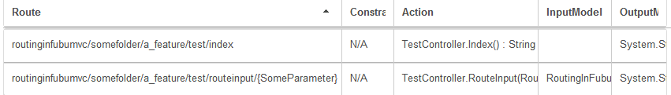

.. _urlconventions:

==============================
Out-of-the-Box URL Conventions
==============================

Routes, like most things in FubuMVC, are applied conventionally. This means you
can set them explicitly, or configure FubuMVC with rules by which it should
automatically determine routes for actions.

In FubuMVC, routes are the URL stubs by which a given action can be invoked. For
example */people/charlie* might map to the ``Load()`` method on the
``PeopleAction`` type (or ``Index`` method on the ``PeopleController`` if you
like to use the term "Controller" for action types).

In FubuMVC, there is no need to maintain a messy list of regular expressions in
a ``Routes.cs`` file, as is the case with ASP.NET MVC.  FubuMVC comes with
sensible default conventions you can immediately utilize, or you have the power
to craft your own URL policies exactly the way you want.

The first requirement is to tell FubuMVC how to find your controller action
methods. There are numerous ways to configure this under the :ref:`Actions DSL
of FubuRegistry <registry-actions-hive>`; this document assumes controller
actions are found inside of classes that end with ``Controller`` in their type
name. This can be set-up by including the following line in your registry class:

.. code-block:: csharp

   Actions.IncludeClassesSuffixedWithController();

.. _methodtourlbuilder:

URLs from Method Names Containing Underscores
---------------------------------------------

The first pattern checked by the default url conventions is the
``MethodToUrlBuilder``. It is activated when a controller action method name
contains any number of underscore characters. It allows you to specify the HTTP
verb and the entire route from the method name. Here is an example:

.. code-block:: csharp

   public class TestController
   {
       public string post_Data()
       {
           return "POST only: /data";
       }

       public string get_SomeTest_Route()
       {
           return "GET only: /sometest/route";
       }

       public string Any_Http_Verb()
       {
           return "Any HTTP Verb: /any/http/verb";
       }
   }

The first controller action will map to the ``/data`` route and be constrained
to the ``POST`` HTTP verb. The second action will map to the ``/sometest/route``
URL and be constrained to only ``GET`` requests. The last action method will
accept all requests with any HTTP verb on the route ``/any/http/verb``. You may
have also noticed that underscore characters in the method names become slashes
in the resultant URL.

You can see this in action if you use FubuMVC's built-in diagnostics and go to
the Route Explorer:

.. image:: images/routing-method-name-with-underscores.png
   :alt: URLs built conventionally by controller action method names and underscores

You may have noticed an extra route in the diagnostics screenshot that didn't
come from the above code sample. It showcases the ability to pair this URL
strategy with :ref:`Model-Binding <model-binding>` and indicate where place
holders in the URL for dynamic values are located. It was generated from the
following code sample:

.. code-block:: csharp

   public class TestController
   {
       public string Dynamic_Url_Values_PathVal(UrlParameterInputModel input)
       {
           return string.Format("Dynamic_Url_Values: PathVal = '{0}' QueryVal = '{1}'",
               input.PathVal, input.QueryVal);
       }
   }

   public class UrlParameterInputModel
   {
       public string PathVal { get; set; }
       public string QueryVal { get; set; }
   }

The above example matches on a URL of the format
``dynamic/url/values/{PathVal}?QueryVal={some value}``. The name of one of the
input model's public properties (``PathVal``) was found in the name of the
controller action method and made a dynamic segment of the URL. Query string
values are optional and are populated into the input model via model-binding.

This is what it looks like to hit this route in your browser:

.. image:: images/routing-and-model-binding.png
   :alt: Browsing to a route with an route input and query string input

URLs from Namespaces and Controller Type Names
----------------------------------------------

If you don't employ the previous convention, FubuMVC assumes you may want to
have your routes built from the namespace and type name of your controller
action methods. Because namespaces typically follow the code's physical folder
structure, this convention allows your folder structure to manage both code
organization and URL routing if you so choose. Here are two examples:

.. code-block:: csharp

   public namespace RoutingInFubuMVC.SomeFolder.A_Feature
   {
       public class TestController
       {
           public string Index()
           {
               return "/routinginfubumvc/somefolder/a_feature/test/routeinput/index";
           }

           public string RouteInput(RouteParamInputModel input)
           {
               return string.Format(
                   "/routinginfubumvc/somefolder/a_feature/test/routeinput/{{SomeParameter}}: " +
                   "SomeParameter = '{0}'", input.SomeParameter);
           }
       }

       public class RouteParamInputModel
       {
           [RouteInput("defaultValue")]
           public string SomeParameter { get; set; }
       }
   }

You'll notice that underscores remain in the resultant URL in this convention,
and also that the periods in the namespace become slashes. A slash is also
placed between namespace and type name, and between type name and method name as
well. Another noteworthy assumption the framework makes is that you likely don't
want the word ``Controller`` in your URL, so it strips out that phrase if your
action-containing type ends with it.

The sample above also shows another way you can tell FubuMVC to include
a placeholder segment within the URL as a dynamic route input. There is also a
``QueryString`` attribute for informing the framework to automatically model
bind to one of your input model properties.

Here is what you would see in the FubuMVC Diagnostics Route Explorer:

This convention of using the namespace to build the URL can be quite verbose.
For more fine-grained control over this convention, the :ref:`Routes DSL in the
FubuRegistry <registry-routes-hive>` allows for several ways to exclude any
portion of the namespace, controller name, and method name from the URL. There
are also :ref:`Routes DSL hooks for constraining to specific HTTP verbs
<registry-routes-constrain-http-methods>`, like we were able to do with the
:ref:`first default URL convention <methodtourlbuilder>`.

Explicit Configuration for One-Off Scenarios
--------------------------------------------

In the case of one-off situations that don't conform to your conventions, you
can explicity control the URL generated for a specific route. To do this, use
the ``UrlPattern`` attribute like so:

.. code-block:: csharp

   public class TestController
   {
       [UrlPattern("better/url/{RouteParam:defaultValue}")]
       public string GoodNameForActionMethodButBadUrl(TheInputModel input)
       {
           return "Default generated URL overriden by UrlPattern attribute";
       }
   }

   public class TheInputModel
   {
       public string RouteParam { get; set; }
   }

I Just Want to Setup My Own Convention
--------------------------------------

The default conventions that come out-of-the-box are quite useful and require
little to none configuration. They cover many common use cases. However,
sometimes you just need full control over the URLs that are being produced by
FubuMVC. This can be accomplished by :ref:`creating one or more custom routing
policies that adhere to the IUrlPolicy interface <customroutepolicies>`. Whether
you adhere to the built-in polices or make up your own, we strongly encourage
you to :ref:`adopt conventions that best fit the way you want to work and then
let the framework do the rest <registry-routes-conventions-are-your-friend>`.
