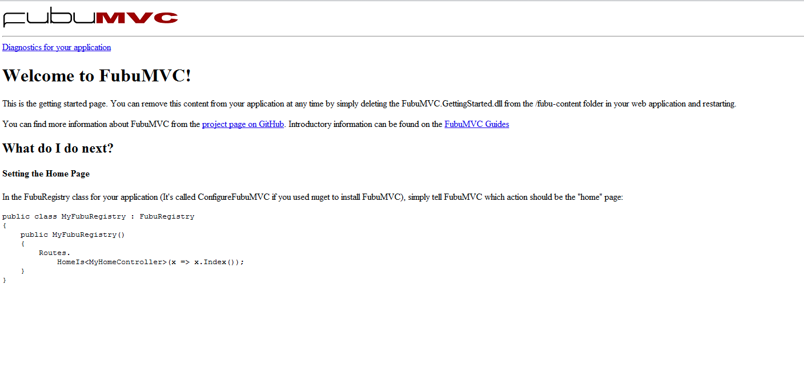
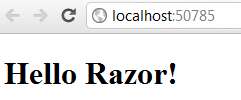
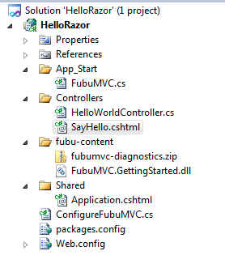

=====
Razor
=====

Getting Started
===============

Using Razor in FubuMVC is a very simple process. We will cover using Razor by
installing the nuget package. After creating an empty web application run the
following install commands from the Package Manager Console::

    Install-Package FubuMVC
    Install-Package FubuMVC.Razor

The FubuMVC nuget package comes with a couple extra things that aren't always
needed but provides a good way to get started. The package comes with the
advanced diagnostics package and some added bootstrapping code to help get
up and running quickly. Later on you may want to install only the 
FubuMVC.References package when you are more familiar and want more control.

Hit F5 and you should see the following.

Wiring up Razor
---------------

Now we need to tell FubuMVC that we want to use the Razor view engine. You
do that by adding this to your ConfigureFubuMVC Registry class.

.. code-block:: csharp

   Import<RazorEngineRegistry>();

Hello Razor!
------------

Now we will add our HelloWorldController

.. code-block:: csharp

  namespace HelloRazor.Controllers
  {
    public class HelloWorldController
    {
         public HelloViewModel SayHello(HelloInputModel input)
         {
             return new HelloViewModel
             {
                 Message = "Hello Razor!",
             };
         }
    }

    public class HelloInputModel
    {
    }

    public class HelloViewModel
    {
        public string Message { get; set; }
    }
  }

Now we can add our first razor view, we have a few options on how to organize
where we place this file. In this example let's add the view in the same
folder as the HelloWorldController. We will also do what the getting started
guide suggested and change our home route.

.. note::

  You need to fully qualify the model type in your razor view.

.. note::

  Be aware that FubuMVC will not see files that have been added after
  bootstrapping has already ran. You can touch the web.config file so
  Razor will see the new files. Edits to existing files will work fine.

The contents of our razor view should look like the following::

  @model HelloRazor.Controllers.HelloViewModel

  <!DOCTYPE html>

  <html>
    <head>
        <title>Say Hello</title>
    </head>
    <body>
        

              <h1>@Model.Message</h1>
        

    </body>
  </html>

Our ConfigureFubuMVC Registry should look look like the following

.. code-block:: csharp

  using FubuMVC.Core;
  using FubuMVC.Razor;
  using HelloRazor.Controllers;

  namespace HelloRazor
  {
    public class ConfigureFubuMVC : FubuRegistry
    {
        public ConfigureFubuMVC()
        {
            // This line turns on the basic diagnostics and request tracing
            IncludeDiagnostics(true);

            // All public methods from concrete classes ending in "Controller"
            // in this assembly are assumed to be action methods
            Actions.IncludeClassesSuffixedWithController();

            // Policies
            Routes
                .HomeIs<HelloInputModel>()
                .IgnoreControllerNamesEntirely()
                .IgnoreMethodSuffix("Html")
                .RootAtAssemblyNamespace();

            Import<RazorEngineRegistry>();

            // Match views to action methods by matching
            // on model type, view name, and namespace
            Views.TryToAttachWithDefaultConventions();
        }
    }
  }

Press F5 and you should see

Now add your first layout (assumption is made you know how to write layout
files for razor). FubuMVC defaults to looking for Application.cshtml
in the Shared folder at the root of our host application. The Application.cshtml
can be as simple as a one-liner like so:

.. code-block:: html

  
Host Application: @RenderBody()

Your solution should look like the following.

You should now see the same message as before.

This concludes the getting started with razor section. Let us know if we
missed anything. Even better, send a pull request for what we did miss.

How to get the Visual Studio tooling to work properly
=====================================================

This process may improve at some point, but these steps describe what's
necessary for the intellisense to work properly in VS.

You first need to add additional references for the following::

  System.Web.WebPages
  System.Web.Mvc

The FubuMVC implementation doesn't depend on those assemblies, but unfortunately
the tooling does for now.

Your web.config must be similar to the below sample. Important sections are the 
sectionGroup section under configSections, the compilation section under system.web 
and the system.web.webPages.razor section.

Lastly, you may need to close and reopen Visual Studio.

.. code-block:: xml

  <?xml version="1.0" encoding="utf-8"?>
  <!--
  For more information on how to configure your ASP.NET application, please visit
  http://go.microsoft.com/fwlink/?LinkId=169433
  -->
  <configuration>
  <configSections>
    <sectionGroup name="system.web.webPages.razor" type="System.Web.WebPages.Razor.Configuration.RazorWebSectionGroup, System.Web.WebPages.Razor, Version=1.0.0.0, Culture=neutral, PublicKeyToken=31BF3856AD364E35">
      <section name="host" type="System.Web.WebPages.Razor.Configuration.HostSection, System.Web.WebPages.Razor, Version=1.0.0.0, Culture=neutral, PublicKeyToken=31BF3856AD364E35" requirePermission="false" />
      <section name="pages" type="System.Web.WebPages.Razor.Configuration.RazorPagesSection, System.Web.WebPages.Razor, Version=1.0.0.0, Culture=neutral, PublicKeyToken=31BF3856AD364E35" requirePermission="false" />
    </sectionGroup>
  </configSections>
  <system.web>
    <compilation debug="true">
      <assemblies>
        <add assembly="System.Core, Version=3.5.0.0, Culture=neutral, PublicKeyToken=B77A5C561934E089" />
        <add assembly="System.Web.Mvc, Version=3.0.0.0, Culture=neutral, PublicKeyToken=31bf3856ad364e35" />
      </assemblies>
    </compilation>
    <pages validateRequest="false" controlRenderingCompatibilityVersion="3.5" clientIDMode="AutoID">
      <namespaces>
        <add namespace="FubuMVC.Core" />
        <add namespace="FubuCore" />
        <add namespace="FubuCore.Reflection" />
        <add namespace="FubuLocalization" />
        <add namespace="FubuMVC.Core.UI" />
        <add namespace="FubuMVC.Core.UI.Extensibility" />
        <add namespace="HtmlTags" />
        <add namespace="HtmlTags.Extended.Attributes" />
        <add namespace="StructureMap" />
        <add namespace="System.Web.Routing" />
      </namespaces>
    </pages>
  </system.web>
  <system.web.webPages.razor>
    <host factoryType="System.Web.Mvc.MvcWebRazorHostFactory, System.Web.Mvc, Version=3.0.0.0, Culture=neutral, PublicKeyToken=31BF3856AD364E35" />
    <pages pageBaseType="FubuMVC.Razor.Rendering.FubuRazorView">
      <namespaces>
        <add namespace="FubuMVC.Razor.Rendering" />
        <add namespace="FubuMVC.Core"/>
        <add namespace="FubuMVC.Core.UI"/>
      </namespaces>
    </pages>
  </system.web.webPages.razor>
  <system.webServer>
    <validation validateIntegratedModeConfiguration="false" />
    <modules runAllManagedModulesForAllRequests="true">
      <!-- To prevent static content from being run thru ASP.NET, we want to set runAllManagedModulesForAllRequests="false"
			   However, UrlRoutingModel will stop working, unless you patch IIS to support extensionless routing (introduced in .NET 4)
			   Download the patch at http://support.microsoft.com/kb/980368  -->
      <remove name="UrlRoutingModule" />
      <add name="UrlRoutingModule" type="System.Web.Routing.UrlRoutingModule, System.Web, Version=4.0.0.0, Culture=neutral, PublicKeyToken=b03f5f7f11d50a3a" preCondition="managedHandler" />
    </modules>
    <handlers>
      <add name="UrlRoutingHandler" preCondition="integratedMode" verb="*" path="UrlRouting.axd" type="System.Web.HttpForbiddenHandler, System.Web, Version=2.0.0.0, Culture=neutral, PublicKeyToken=b03f5f7f11d50a3a" />
    </handlers>
  </system.webServer>
  <location path="Content" allowOverride="true">
    <system.web>
      <authorization>
        <allow users="*" />
      </authorization>
    </system.web>
  </location>
  <location path="_content" allowOverride="true">
    <system.web>
      <authorization>
        <allow users="*" />
      </authorization>
    </system.web>
  </location>
  <location path="fubu-content">
    <system.web>
      <authorization>
        <deny users="*" />
      </authorization>
    </system.web>
  </location>
  </configuration>
