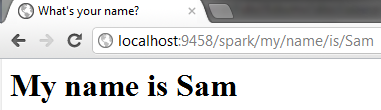

===========================
Using the Spark view engine
===========================

What is Spark?
--------------

Most .NET developers have used the Web Forms view engine, and more recently the
Razor view engine. `Spark <http://sparkviewengine.com>`_ is a view engine where
the markup is allowed to dominate the flow and for the code to fit seamlessly
within the markup.

Let's get started
-----------------

Using Spark in FubuMVC is a very simple process. Currently, there are two
options:

    #. NuGet install
    #. As a Bottle (package)

We're going to focus on the NuGet way first since it is the easiest and fastest
way to get up and running with Spark. If you've followed the :doc:`Getting
Started <../gettingstarted>` guide, this should look very familiar.

.. image:: images/spark_nuget.png
   :alt: Installing FubuMVC.Spark with NuGet.

.. note::

    If the NuGet GUI isn't your style, you can also install Spark support from
    the Package Manager Console by typing: ``install-package FubuMVC.Spark``

And that's it! The next thing you'll want to know is how to actually start using
Spark now that you've installed it.

Wiring up Spark
---------------

Wiring up Spark in a FubuMVC application is actually very simple. Once you've
added the Spark reference, there is one line needed in the ``FubuRegistry`` class.

.. TODO: Probably should turn this into a literal include.

.. code-block:: csharp

    this.UseSpark()

And you're up and running with Spark, easy!

Hello, Spark!
-------------

So now that we have Spark wired up, what are some of the things we can do with
it? Well, let's get started on that right now. Lets start with the `Getting
Started <../gettingstarted>` guide's basic "Hello, World" and make it use Spark.

We last left off with our controller action looking like this:

.. literalinclude:: ../../../../src/QuickStart/SayHelloController.cs
   :lines: 47-66
   :linenos:

Converting from FubuHtml to Spark
'''''''''''''''''''''''''''''''''

So what do we need to do to switch over from FubuHtml over to Spark after we've
added ``this.UseSpark()`` in our ``FubuRegistry``? First we need to change the
return type of the method to a view model.

.. literalinclude:: ../../../../src/QuickStart/SayHelloSparkController.cs
   :lines: 5
   :linenos:

.. note::

    We've updated the route slightly so we don't conflict with the original
    route.

Like the NameModel, the SparkHelloViewModel is a simple POCO that the
get_spark_my_name_is_Name method returns. This class looks like this:

.. literalinclude:: ../../../../src/QuickStart/SayHelloSparkController.cs
   :lines: 37-40
   :linenos:

Now let's create the Spark view that we want to use with this controller
action.

.. literalinclude:: ../../../../src/QuickStart/HelloSpark/SayHelloWithoutMaster.spark
   :linenos:
   :language: html

.. warning::

    Currently it is required to use the fully qualified name of the view model
    with FubuMVC.Spark views. So ``<viewdata model="SparkHelloViewModel" />``
    does not work.

Now we can navigate to ``spark/say/my/name/is/Sam`` and we get this view:

Wiring views to controller actions
''''''''''''''''''''''''''''''''''

So how did we wire up the spark view with the right controller action?
FubuMVC.Spark will attempt to attach the view based on three default
conventions.

    * by_ViewModel_and_Namespace_and_MethodName()
    * by_ViewModel_and_Namespace()
    * by_ViewModel()

This allows for a high level of flexibility in where one decides to put the
Spark views in relation to the controller. You don't have to put your Spark
files in a ``Views`` folder if you don't want to.

Master pages
------------

We've got our view set up, but what if we were to add 10 more controller actions
with their own Spark views. Wouldn't we be repeating the same boilerplate HTML
in each one of these files? What does Spark offer to help solve this problem?

As you might have guessed from the heading title, Spark has master pages that
can be used to include containing HTML such as the head, and body along with any
supporting HTML structure you need.

So how do we go about setting up a master page? First we need to create a folder
named ``Shared`` in the root of our project, then in that directory create a
file named ``Application.spark``.

.. image:: images\spark_master_page.png
   :alt: Application.spark under the Shared\ folder

In this file we can place all our HTML that we'd like each page to have. So we
can take much of what is in the first Spark view and move it to the
``Application.Spark`` which looks like this:

.. literalinclude:: ../../../../src/QuickStart/Shared/Application.spark
   :linenos:
   :language: html

So what's this ``<use:view />`` tag in the ``Application.spark``? That is called
a content section in Spark and it renders the view HTML from your action where
this tag is located.

When we strip away the extra HTML from our Spark file we get this:

.. literalinclude:: ../../../../src/QuickStart/HelloSpark/SayHello.spark
   :linenos:
   :language: html

All the contents of this file are placed where the ``<use:view />`` tag was in
the ``Application.spark`` file excluding what had been placed in the
``<content:title>`` tag.

So what exactly is that ``<content:title>`` tag? It is called a named region.
In the master file they look like ``<use content="title />`` and you may have
noticed that was there in the ``Application.spark`` file.  This lets you add
multiple sections in a file that you can insert the view content into.

For example, many people have a named content in the ``<head>`` of their master
page to insert additional styles or scripts per view.

Multiple master pages
'''''''''''''''''''''

Aside from the Application.spark, it is very possible to have as many master
pages as you decide to have. Spark allows you to specify the master file in a
few different ways.

    * **Implicit**: no usage of ``<use master="..." />`` this will default to
      the ``Application.spark`` under the ``Shared`` folder.
    * **Explicit**: E.g. ``<use master="AlternateLayout" />`` this would use the
      spark file ``AlternateLayout.spark`` in the ``Shared`` folder.
    * **Supressing** ``<use master="" />`` this will tell Spark that you do not
      want to use a master page.

So there you have it! You're now up and running with Spark with FubuMVC and you
can start digging deeper into the details. From here, read up on some details of
using Spark and FubuMVC and have fun!

Fubu partials vs a Spark partials?
----------------------------------

When using FubuMVC and Spark together there is one area that has meaning to both
projects. That is the term 'partial'. So what exactly is the difference betweeen
a Fubu partial and a Spark partial? Let's dig into that and find out.

A Fubu partial is generally called inside a view or possibly a ``bindings.xml``
that uses the ``this.Partial()`` syntax. This in turn goes through the full
FubuMVC pipeline (behaviors, etc.) which means it can make its own DB queries,
validation, etc. It basically a separate request that gets its output rendered
in the parent stream.

A Spark partial is tied to the parent, what this means is that the Fubu pipeline
with its behaviors, validation, etc. are run one single time and then the Spark
view engine handles rendering the partial views. Fubu partials, on the other
hand, could possibly be rendered outside by hitting the partial's path with an
HTTP request.

FubuMVC.Spark Limitations
-------------------------

Much work has gone into integrating Spark as a first-class view engine in
FubuMVC. Because of this work though, not all features of Spark are currently
available with the FubuMVC.Spark package. Here is a list of some of the features
currently unsupported in FubuMVC.Spark:

    * No support for languages other than C#
    * Including files with ``<include href="">`` is not currently working
    * Dynamic view data in the form of ``<use viewdata Caption="string">`` is
      not supported.
    * The full type name must be specified in the Spark file. The ``<use
      namespace="..." />`` is not currently accounted for.
    * Two output types of the same qualified name the view will not be attached
      as the code does not attempt to decide which to attach.

.. note::

    If there is a conflict with qualified names, there will be a log message in
    the diagnostics log.

While these features aren't available in FubuMVC right now, that is not to say
that they will not be added as FubuMVC.Spark improves.

Some advanced Spark
-------------------

This guide has only scratched the surface of the features available in
FubuMVC.Spark. Some of the more advanced features of Spark and FubuMVC will be
discussed in an advanced FubuMVC.Spark guide. Some of these features include:

    * Using Spark bindings

      * Using bindings with Bottles

    * Spark as a package
    * Rendering strategies
